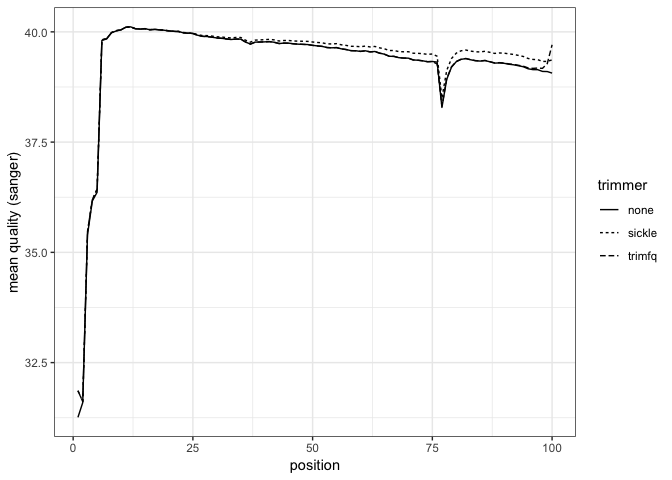
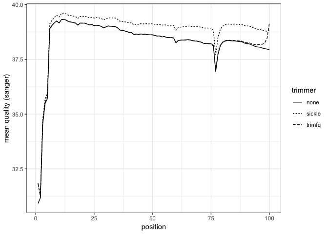
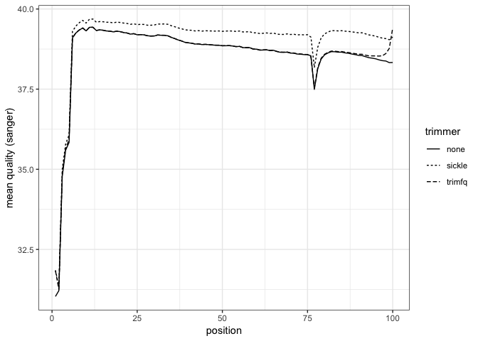

``` r
source("https://bioconductor.org/biocLite.R")
```

    ## Bioconductor version 3.7 (BiocInstaller 1.30.0), ?biocLite for help

``` r
biocLite("qrqc")
```

    ## BioC_mirror: https://bioconductor.org

    ## Using Bioconductor 3.7 (BiocInstaller 1.30.0), R 3.5.1 (2018-07-02).

    ## Installing package(s) 'qrqc'

    ## 
    ## The downloaded binary packages are in
    ##  /var/folders/8n/f2yc_nqn0kg10tvry03g2jdw0000gn/T//Rtmpa6XFb3/downloaded_packages

    ## Old packages: 'reshape'

``` r
library(qrqc)
```

    ## Loading required package: reshape

    ## Loading required package: ggplot2

    ## Loading required package: Biostrings

    ## Loading required package: BiocGenerics

    ## Loading required package: parallel

    ## 
    ## Attaching package: 'BiocGenerics'

    ## The following objects are masked from 'package:parallel':
    ## 
    ##     clusterApply, clusterApplyLB, clusterCall, clusterEvalQ,
    ##     clusterExport, clusterMap, parApply, parCapply, parLapply,
    ##     parLapplyLB, parRapply, parSapply, parSapplyLB

    ## The following objects are masked from 'package:stats':
    ## 
    ##     IQR, mad, sd, var, xtabs

    ## The following objects are masked from 'package:base':
    ## 
    ##     anyDuplicated, append, as.data.frame, basename, cbind,
    ##     colMeans, colnames, colSums, dirname, do.call, duplicated,
    ##     eval, evalq, Filter, Find, get, grep, grepl, intersect,
    ##     is.unsorted, lapply, lengths, Map, mapply, match, mget, order,
    ##     paste, pmax, pmax.int, pmin, pmin.int, Position, rank, rbind,
    ##     Reduce, rowMeans, rownames, rowSums, sapply, setdiff, sort,
    ##     table, tapply, union, unique, unsplit, which, which.max,
    ##     which.min

    ## Loading required package: S4Vectors

    ## Loading required package: stats4

    ## 
    ## Attaching package: 'S4Vectors'

    ## The following objects are masked from 'package:reshape':
    ## 
    ##     expand, rename

    ## The following object is masked from 'package:base':
    ## 
    ##     expand.grid

    ## Loading required package: IRanges

    ## Loading required package: XVector

    ## 
    ## Attaching package: 'Biostrings'

    ## The following object is masked from 'package:base':
    ## 
    ##     strsplit

    ## Loading required package: biovizBase

    ## Loading required package: brew

    ## Loading required package: xtable

    ## Loading required package: Rsamtools

    ## Loading required package: GenomeInfoDb

    ## Loading required package: GenomicRanges

    ## Loading required package: testthat

``` r
library(ggplot2)
getwd()
```

    ## [1] "/Users/studentuser/Desktop/Laura/laura-quantseq/notebooks"

``` r
fqfiles.43.R1 <- c(none="../data/CP-4Spl_S11_L004_R1_0343.fastq",
             sickle="../data/CP-4Spl_S11_L004_R1_0343_sickle.fastq",
             trimfq="../data/CP-4Spl_S11_L004_R1_0343_trimfq.fastq")

fqfiles.43.R2 <- c(none="../data/CP-4Spl_S11_L004_R2_0343.fastq",
             sickle="../data/CP-4Spl_S11_L004_R2_0343_sickle.fastq",
             trimfq="../data/CP-4Spl_S11_L004_R2_0343_trimfq.fastq")
```

Load each file in, using qrqc's readSeqFile We only need qualities, so we turn off some of readSeqFile's other features.

``` r
seq_info.43.R1 <- lapply(fqfiles.43.R1, function(file) {
          readSeqFile(file, hash=FALSE, kmer=FALSE)
})
seq_info.43.R2 <- lapply(fqfiles.43.R2, function(file) {
          readSeqFile(file, hash=FALSE, kmer=FALSE)
})
```

Extract the qualities as dataframe, and append a column of which trimmer (or none) was used. This is used in later plots.

``` r
quals.43.R1 <- mapply(function(sfq, name) {
          qs <- getQual(sfq)
          qs$trimmer <- name
          qs
}, seq_info.43.R1, names(fqfiles.43.R1), SIMPLIFY = FALSE)

quals.43.R2 <- mapply(function(sfq, name) {
          qs <- getQual(sfq)
          qs$trimmer <- name
          qs
}, seq_info.43.R2, names(fqfiles.43.R2), SIMPLIFY = FALSE)
```

Combine separate dataframes in a list into single dataframe

``` r
d.43.R1 <- do.call(rbind, quals.43.R1)
d.43.R2 <- do.call(rbind, quals.43.R2)
```

Visualize qualities

``` r
p1 <- ggplot(d.43.R1) + geom_line(aes(x=position, y=mean, linetype=trimmer))
p1 <- p1 + ylab("mean quality (sanger)") + theme_bw()
print(p1)
```

This plot shows quality of trimmed/untrimmed file against bp length for read #1 for lane identified with 0343 (file = CP-4Spl_S11_L004_R1_0343.fastq) 



``` r
p2 <- ggplot(d.43.R2) + geom_line(aes(x=position, y=mean, linetype=trimmer))
p2 <- p2 + ylab("mean quality (sanger)") + theme_bw()
print(p2)
```

Read #2 for the lane identified with 0343 (file = CP-4Spl_S11_L004_R2_0343.fastq) 



Repeat with the other 2 data files, which are from the other lane:
------------------------------------------------------------------

``` r
fqfiles.48.R1 <- c(none="../data/CP-4Spl_S11_L004_R1_0348.fastq",
             sickle="../data/CP-4Spl_S11_L004_R1_0348_sickle.fastq",
             trimfq="../data/CP-4Spl_S11_L004_R1_0348_trimfq.fastq")

fqfiles.48.R2 <- c(none="../data/CP-4Spl_S11_L004_R2_0348.fastq",
             sickle="../data/CP-4Spl_S11_L004_R2_0348_sickle.fastq",
             trimfq="../data/CP-4Spl_S11_L004_R2_0348_trimfq.fastq")

seq_info.48.R1 <- lapply(fqfiles.48.R1, function(file) {
          readSeqFile(file, hash=FALSE, kmer=FALSE)
})
seq_info.48.R2 <- lapply(fqfiles.48.R2, function(file) {
          readSeqFile(file, hash=FALSE, kmer=FALSE)
})

quals.48.R1 <- mapply(function(sfq, name) {
          qs <- getQual(sfq)
          qs$trimmer <- name
          qs
}, seq_info.48.R1, names(fqfiles.48.R1), SIMPLIFY = FALSE)

quals.48.R2 <- mapply(function(sfq, name) {
          qs <- getQual(sfq)
          qs$trimmer <- name
          qs
}, seq_info.48.R2, names(fqfiles.48.R2), SIMPLIFY = FALSE)

d.48.R1 <- do.call(rbind, quals.48.R1)
d.48.R2 <- do.call(rbind, quals.48.R2)

p3 <- ggplot(d.48.R1) + geom_line(aes(x=position, y=mean, linetype=trimmer))
p3 <- p3 + ylab("mean quality (sanger)") + theme_bw()
print(p3)
```

This plot shows quality of trimmed/untrimmed file against bp length for read #1 for lane identified with 0348 (file = CP-4Spl_S11_L004_R1_0348.fastq) 


``` r
p4 <- ggplot(d.48.R2) + geom_line(aes(x=position, y=mean, linetype=trimmer))
p4 <- p4 + ylab("mean quality (sanger)") + theme_bw()
print(p4)
```

read #2 for lane identified with 0348 (file = CP-4Spl_S11_L004_R1_0348.fastq) 


